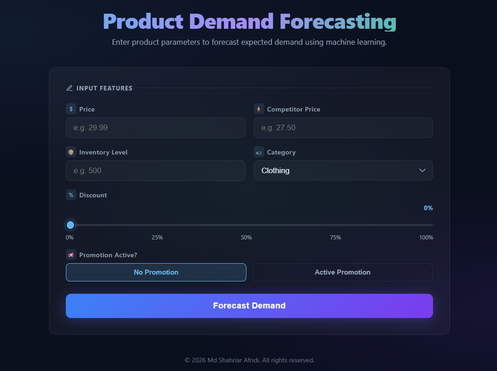

# Product Demand Forecasting

A machine learning web application that predicts product demand based on pricing, discounts, inventory, promotions, and product category. The model is trained using XGBoost and served through a FastAPI backend with a browser-based frontend.

---

## Screenshot



---

## Project Structure

```
product-demand-forecasting/
├── dataset/
│   └── demand_forecasting.csv      # Dataset used for training
├── models/
│   ├── xgboost_demand_model.pkl    # Trained XGBoost model (generated by model-train.ipynb)
│   └── label_encoders.pkl          # Fitted label encoders for categorical features
├── screenshot/
│   └── screenshot.png              # App screenshot
├── server.py                       # FastAPI backend — serves the UI and prediction API
├── index.html                      # Frontend — single-page HTML/CSS/JS app
├── app.py                          # Streamlit version of the app (alternative interface)
├── model-train.ipynb               # Notebook used to train the XGBoost model
├── analysis.ipynb                  # Exploratory data analysis notebook
├── requirements.txt                # Python dependencies
└── venv/                           # Conda virtual environment (not committed to git)
```

---

## Prerequisites

- Python 3.10+ (or Conda)
- All dependencies listed in `requirements.txt`

---

## Setup

### 1. Create and activate a virtual environment (recommended)

```bash
conda create -p ./venv python=3.11
conda activate ./venv
```

Or with standard venv:

```bash
python -m venv venv
venv\Scripts\activate      # Windows
source venv/bin/activate   # macOS / Linux
```

### 2. Install dependencies

```bash
pip install -r requirements.txt
```

---

## Running the Web App (FastAPI)

### Start the server

```bash
python server.py
```

### Open the app

Visit **http://localhost:5000** in your browser.

> FastAPI also provides auto-generated interactive API docs at **http://localhost:5000/docs**.

---

## Running the Streamlit App (alternative)

```bash
streamlit run app.py
```

---

## How It Works

1. `server.py` loads the pre-trained model (`models/xgboost_demand_model.pkl`) and label encoders (`models/label_encoders.pkl`) on startup.
2. The frontend (`index.html`) fetches available product categories from `/api/categories` when the page loads.
3. You fill in the product parameters and click **Forecast Demand**.
4. The form data is sent as JSON to `/api/predict`.
5. The server label-encodes the category, runs model inference, and returns the predicted demand.
6. The result is displayed with an animated counter.

---

## Input Features

| Feature | Type | Description |
|---|---|---|
| Price | Float | Product selling price |
| Discount | Integer (0–100) | Discount percentage applied |
| Inventory Level | Integer | Current stock available |
| Promotion | Binary (0 / 1) | Whether a promotion is currently active |
| Competitor Pricing | Float | Competitor's price for the same product |
| Category | Categorical | Product category (loaded dynamically from the model) |

**Output:** Predicted demand — the number of units expected to be sold (integer).

---

## API Endpoints

| Method | Endpoint | Description |
|---|---|---|
| `GET` | `/` | Serves the HTML frontend |
| `GET` | `/api/categories` | Returns the list of available product categories |
| `POST` | `/api/predict` | Accepts product features and returns demand prediction |

### POST `/api/predict`

**Request body:**

```json
{
  "price": 29.99,
  "discount": 10,
  "inventory_level": 500,
  "promotion": 1,
  "competitor_pricing": 27.50,
  "category": "Electronics"
}
```

**Response:**

```json
{
  "prediction": 342
}
```

---

## Retraining the Model

Open `model-train.ipynb` in Jupyter and run all cells. This will regenerate `models/xgboost_demand_model.pkl` and `models/label_encoders.pkl` from `dataset/demand_forecasting.csv`.

```bash
jupyter notebook model-train.ipynb
```
